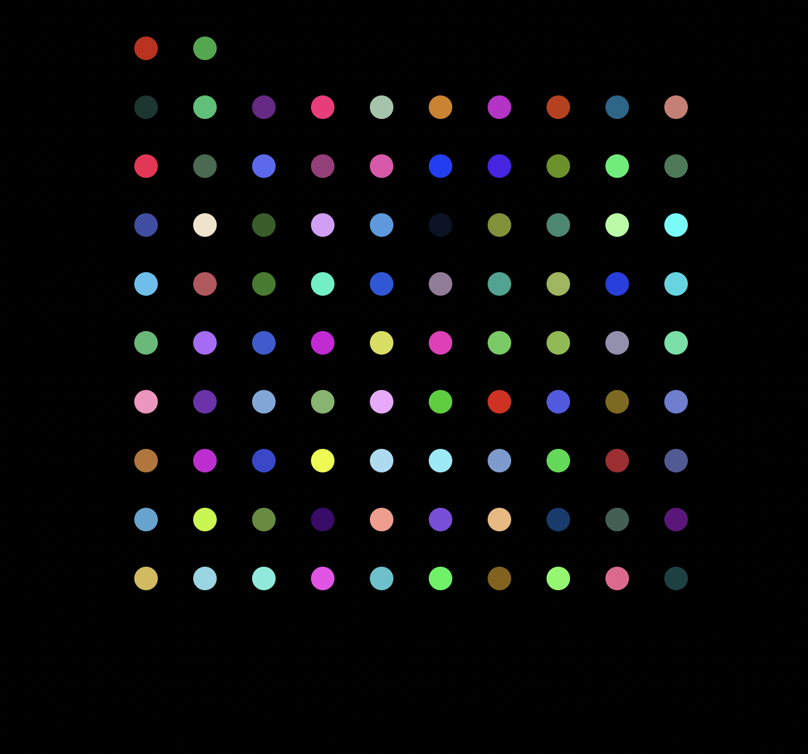
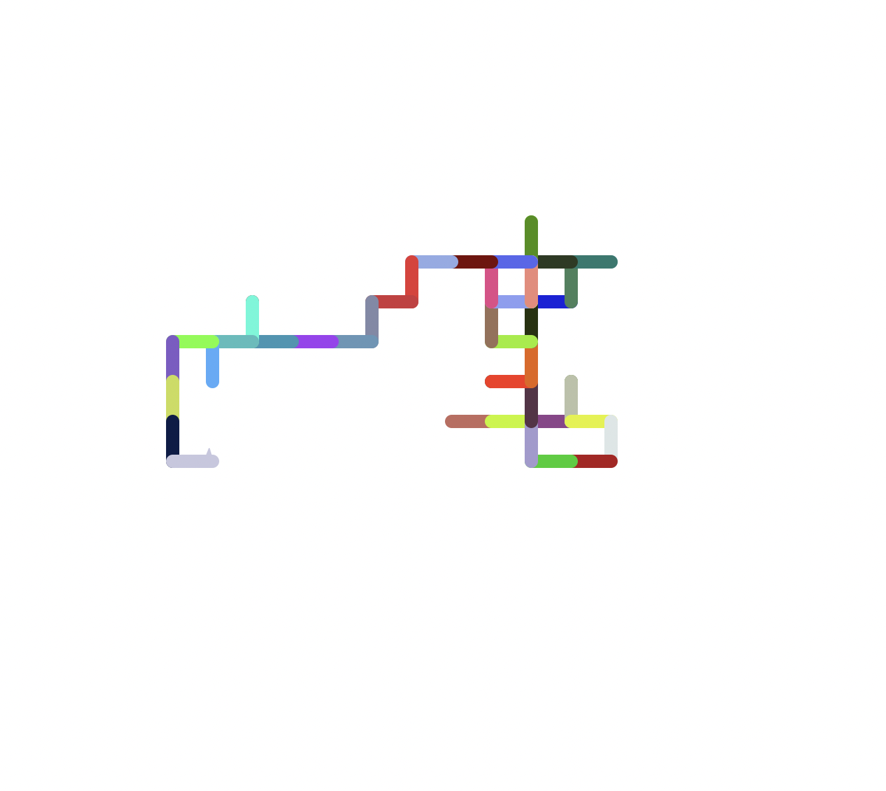
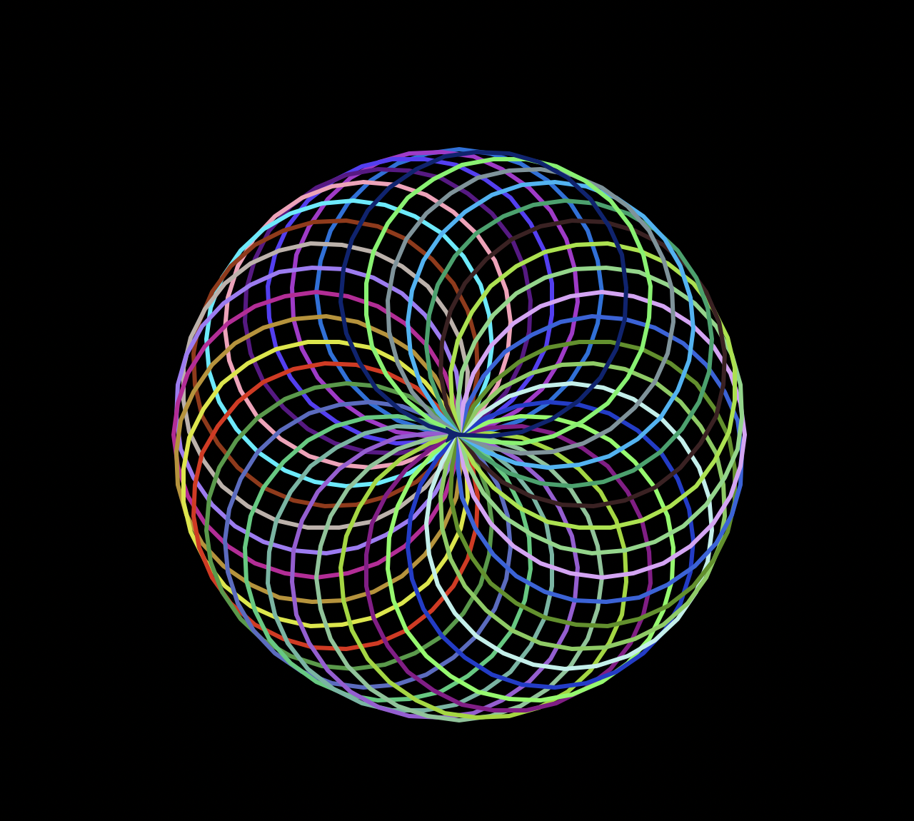

# Turtle Applications

This repository contains multiple Python applications that utilize the `turtle` module for creating visually appealing graphics and animations. Each application showcases different features and techniques of the `turtle` module.

## Applications

### Application 1: Random Dot Grid

This application creates a random dot grid using the `turtle` module. It generates a grid of dots with random colors and positions on the screen.

### Application 2: Random Walk

This application demonstrates a random walk using the `turtle` module. The turtle moves forward a fixed distance and then turns randomly, creating an interesting pattern.

### Application 3: Colorful Spiral

This application draws a colorful spiral using the `turtle` module. The turtle rotates gradually while drawing circles of different colors, resulting in a visually appealing spiral pattern.

## Dependencies

These applications require the following dependencies:

- Python 3.x
- turtle module (included in Python standard library)

## Disclaimer

These applications are for educational purposes and demonstrate the capabilities of the `turtle` module. Please use them responsibly and with respect for your system's resources.

## Contributing

If you have any improvements or suggestions for these applications, feel free to contribute by creating a pull request. Your contributions are greatly appreciated!