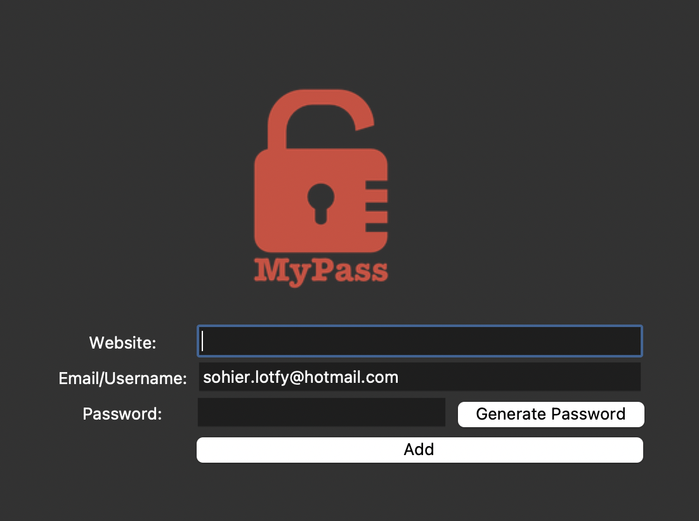

# Password Manager

The Password Manager is a simple yet powerful application built using Python and Tkinter. It provides a user-friendly interface for managing and securely storing passwords for various websites. With this app, users can generate strong passwords, save them along with corresponding website details, and retrieve them when needed.

