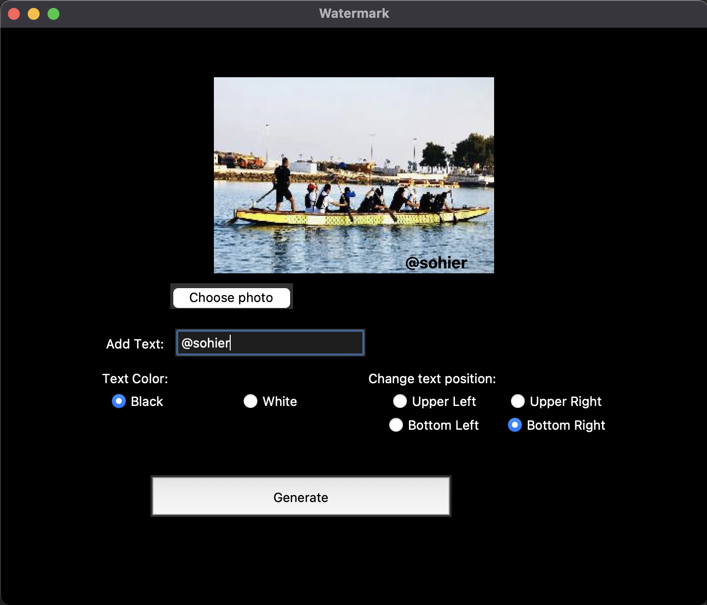

# Watermark generator
The Watermarking Tool is a graphical user interface (GUI) application developed using  Tkinter library. This tool allows users to upload an image, add a text watermark to it, and save the watermarked image.

## Features:

- Photo Upload: Users can choose an image file (JPEG format) from their local system to upload into the application. The selected image is displayed on a canvas within the application window.

- Text Watermarking: Users can enter a text string to be used as the watermark. They can also select the color of the text (black or white) and the position of the watermark (upper left, upper right, bottom left, or bottom right).

- Dynamic Canvas: The canvas dynamically adjusts its size to match the dimensions of the uploaded image. This ensures that the watermark is positioned correctly and accurately reflects the image's aspect ratio.

- Real-Time Preview: As users enter the watermark text and choose its position and color, the application provides a real-time preview of the watermark on the image. This helps users visualize the final result before generating the watermarked image.

- Generate Watermarked Image: Upon clicking the "Generate" button, the application applies the chosen watermark to the uploaded image and saves the watermarked image as a new JPEG file in a specified location.

## Dependencies
The Watermark project requires the following dependencies:

- Python 3.x
- PIL (Python Imaging Library)
- tkinter (Python's standard GUI library)

## Acknowledgments

The Watermark project was developed as a practical exercise to explore image manipulation and GUI programming in Python. It draws inspiration from various watermarking tools and tutorials available online.

Feel free to customize and enhance the program according to your needs. Contributions and suggestions are always welcome!

Protect and personalize your images easily with the Watermark application!