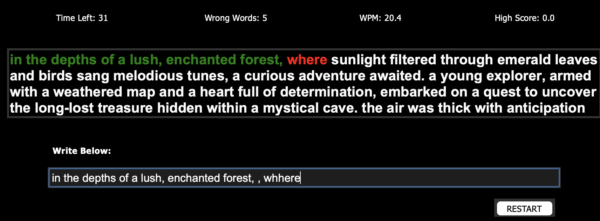

# Typing Speed Test

The Typing Speed Test is a simple Python program that allows users to measure their typing speed in words per minute (WPM). It provides a user-friendly interface where users can enter the displayed text, and the program will track their speed and accuracy.

## Features

- **Countdown timer:** The program starts with a countdown timer of 60 seconds, during which users need to type as many words as they can.
- **Real-time feedback:** As the user types, the program highlights the entered text in green if it matches the displayed text, and in red if there are any errors.
- **Mistake tracking:** The program keeps track of the number of mistakes made by the user.
Word per minute (WPM) calculation: Once the time is up, the program calculates the user's typing speed in WPM based on the number of characters typed.
- **High score record:** The program maintains a high score record, storing the highest achieved WPM. It displays the high score for reference.
Restart functionality: Users can restart the typing speed test at any time to begin a new session.

## How to Use

- Clone the repository or download the source code files to your local machine.
- Ensure you have Python 3.x installed.
Install the required dependencies, if any (specified in the project's requirements.txt file).
- Run the typing_speed_test.py file using a Python IDE or by executing the command python typing_speed_test.py in your terminal.
- The program's GUI will appear, displaying the countdown timer and the text to be typed.
- Start typing in the input field and observe the real-time feedback provided by the program.
After the time is up, the program will display your WPM score and update the high score if applicable.
- To restart the test, click the "RESTART" button.
  
## Dependencies

- Python 3.x
- tkinter (Python's standard GUI library)

## Acknowledgments
The Typing Speed Test project was developed as a learning exercise and is inspired by various typing speed test applications and tutorials available online.

Feel free to customize and enhance the program according to your needs. Contributions and suggestions are always welcome!

Enjoy improving your typing speed with the Typing Speed Test!